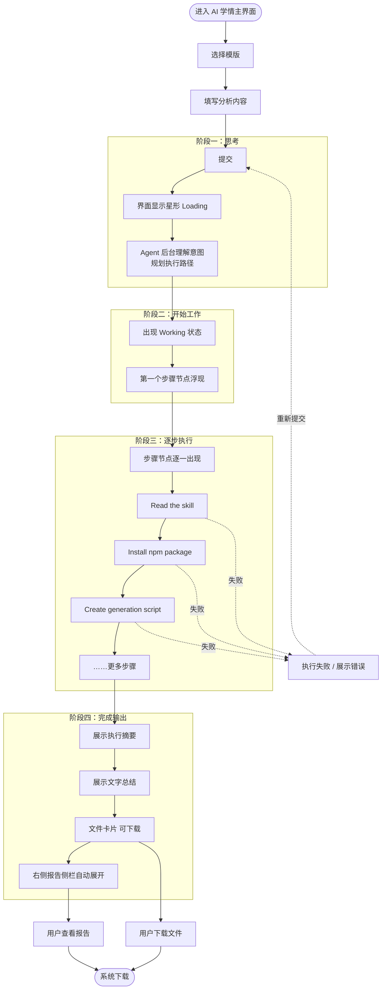
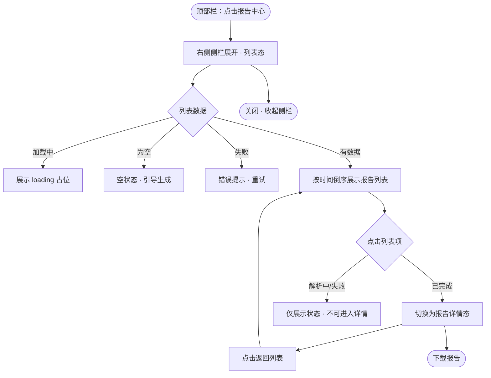

# 学情报告 & 自定义能力 — 页面设计说明

> 来源：产品 PRD《学情报告 & 自定义能力》改写整理。
> 适用范围：AI 学情主界面及学情报告查看 / 下载相关页面。
> 当前流程：选择模版 → 输入分析内容 → 提交 → Agent 解析 → 展示报告 → 查看 / 下载。

---

## 1. 页面目标

- 在「自由提问」之外，为用户提供**标准化的学情可视化报告**这一交付物形态。
- 让用户通过**选择预设模版 + 输入分析内容**，快速获得符合需求的标准化可视化报告，无需自行维护模版。
- 让用户能够便捷地**查看、下载**由 Agent 解析并生成的学情报告。
- 通过顶部栏的**报告中心**入口，让用户**集中浏览并回看**历史已生成的所有报告，无需在对话流中向上翻找。

## 2. 用户角色

- **普通用户 / 教师**：选择模版、输入分析内容（分析对象、时间范围等）、查看与下载报告。
- **AI Agent（系统角色）**：解析用户输入、识别可视化报告需求、自主规划报告内容、调用工具完成数据获取 / 指标计算 / 前端渲染，并返回报告。

## 3. 主要任务

1. 选择报告模版。
2. 输入分析内容（分析对象、时间范围等）并提交。
3. 等待 Agent 解析并生成学情报告。
4. 查看学情报告全文。
5. 下载学情报告。
6. 打开**报告中心**，集中浏览历史报告列表，并从列表进入任意一份报告查看详情。

### 交互流程（含 Agent 处理流程）

Agent 的可见交互分为四个阶段，界面状态随阶段逐步演进。

#### 阶段一：思考
- 【用户】发出指令（选择模版 + 输入分析内容 + 提交）
- 【Agent】界面显示星形旋转 Loading 图标
- 【Agent】在后台理解意图、规划执行路径
- 界面状态：**尚无任何可见操作步骤**，仅呈现 Loading

#### 阶段二：开始工作
- 【Agent】出现 **Working** 状态标识
- 【Agent】第一个步骤节点浮现（如 *Read the skill*）
- 【Agent】读取技能文件，准备具体执行

#### 阶段三：逐步执行
- 【Agent】步骤节点**一个接一个出现**，形成可见的执行链路
- 【Agent】每个步骤完成后才显示下一个，过程透明可追踪
- 示例步骤节点：`Read the skill` → `Install npm package` → `Create generation script` → ……
- > 失败处理：任一步骤失败 → 展示错误提示 → 允许用户重新提交（回到阶段一）

#### 阶段四：完成输出
- 【Agent】顶部展示执行摘要（如：已运行 3 条命令、查看 1 个文件、创建 1 个文件）
- 【Agent】展示文字总结，说明生成内容的结构与要点
- 【Agent】底部出现可下载文件卡片（Document · DOCX）
- 【系统】右侧报告侧栏**自动展开**，呈现最终报告全文
- 【用户】可直接在卡片点击下载，或在报告侧栏内查看 / 下载

## 4. 页面入口

- **模版选择入口**：AI 学情主界面中提供模版选择与内容输入区。
- **报告查看入口**（两类）：
  - AI 学情主界面中的**学情报告卡片**，完成后点击进入报告全文。
  - **报告中心入口**：顶部栏（head 栏）右侧的「报告中心」入口，点击后**展开右侧侧栏**并以列表形式集中展示已生成报告；点击列表中任意一份报告进入其详情。
- **下载入口**（两类）：
  - 学情报告卡片上的「下载」按钮。
  - 学情报告弹窗 / 侧边栏标题栏按钮区的「下载」按钮。

## 5. 页面结构

- **AI 学情主界面**
  - 顶部栏（head）：产品标识 + **报告中心入口**（右侧）。
  - 内容区：对话流 + 学情报告卡片（解析中 / 已完成两种形态）。
  - 输入区：模版选择 + 分析内容输入 + 提交。
- **报告中心侧栏**（与报告详情共用右侧侧栏容器，包含两种内容态）
  - **列表态**：标题栏（标题「报告中心」+ 关闭按钮，可含搜索 / 筛选）+ 报告列表（每项含标题、生成时间、格式、状态）。
  - **详情态**：由列表项或报告卡片进入；从列表进入时标题栏提供「返回列表」入口。
- **学情报告详情**（在 ClassIn 中以弹窗 / 侧边栏形式打开，具体形态参照设计侧方案）
  - 标题栏按钮区：下载按钮（从报告中心进入时另含返回列表入口）。
  - 正文区：报告全文（可视化内容模块、指标、图表等）。

## 6. 核心信息字段

- **模版**：预设的报告模版（决定内容模块、指标、图表、样式）。
- **分析内容**：用户输入的分析对象、时间范围等参数。
- **报告内容**：Agent 规划并渲染的可视化模块、指标、图表。
- **报告状态**：解析中 / 已完成 / 失败。
- **文件类型**：html、pdf、word（更多类型待定）。
- **报告列表项**（报告中心）：标题、生成时间、报告状态、文件类型、（可选）模版类型，用于在列表中标识与排序。

## 7. 主要操作

- **选择模版**：从预设模版中选择一个。
- **输入分析内容**：填写分析对象、时间范围等并提交。
- **生成报告**：提交后触发 Agent 解析并生成学情报告。
- **查看报告**：点击学情报告卡片查看全文。
- **打开报告中心**：点击顶部栏入口，展开侧栏并展示报告列表。
- **浏览报告列表**：在报告中心侧栏中按时间倒序浏览历史报告，（可选）通过搜索 / 筛选定位目标报告。
- **从列表查看详情**：点击列表中某一份已完成报告，侧栏切换为该报告详情；可「返回列表」继续浏览。
- **下载**：将报告（含对话结果等交付物形态）下载为 PDF 等格式，点击后唤起系统下载（具体参照设计侧方案）。

## 8. 状态

| 状态 | 说明 |
| --- | --- |
| **默认** | 提供模版选择与内容输入；已完成的学情报告卡片为静态样式入口，可点击查看 / 下载。 |
| **加载中** | 提交后 Agent **异步解析**，报告卡片在解析期间需展示 loading 动效；前端**轮询**直至后端返回「生成完毕」状态，卡片随后变为静态入口。 |
| **空状态** | 暂无报告 / 无可展示内容时的占位与引导（PRD 未明确，按通用规范补充）。 |
| **错误** | 解析失败 / 下载失败时的提示与**重试**（PRD 未明确，按通用规范补充）。 |
| **权限不足** | 用户无权查看 / 下载对应报告时的拦截提示（PRD 未明确，按通用规范补充）。 |
| **报告中心 · 列表态** | 列表加载中（拉取历史报告时的占位）/ 列表为空（尚无任何报告时的占位与引导）/ 列表加载失败（拉取失败的提示与重试）。 |

> 注：空状态、错误、权限不足及报告中心列表三态原 PRD 未展开，需与设计侧进一步确认。

## 9. 业务规则

- 学情报告采用**异步生成**机制：提交后先返回解析中卡片，前端轮询后端状态，完成后切换为可点击的静态入口。
- **解析失败可重试**：失败状态下允许用户重新提交触发解析。
- 用户**直接选择预设模版**生成报告，不涉及模版的维护 / 新建 / 编辑。
- 下载能力覆盖**所有交付物形态**：包括对话结果与学情报告等，统一支持下载为 PDF。
- 报告查看在 **ClassIn** 内以弹窗 / 侧边栏形式打开。
- **报告中心与报告详情共用同一右侧侧栏容器**：从顶部栏入口进入为「列表态」，从列表项或报告卡片进入为「详情态」，两态之间可来回切换。
- **报告列表默认按生成时间倒序**（最新在上）。
- 列表中**仅「已完成」状态的报告可点击进入详情**；解析中 / 失败的报告在列表中以对应状态标识呈现，不提供查看详情入口（避免进入空白 / 报错）。
- 报告中心的列表数据与对话流中的报告卡片**指向同一份报告**，状态保持一致。

## 10. 设计参考

- 报告查看交互（弹窗 / 侧边栏形态）：参照设计侧方案。
- 下载交互：参照设计侧方案。
- 样式参考：PRD 内附约 4 秒演示视频，以及「ima 智能助手生成测验」的界面示意（智能助手对话 + 「生成测验」「语文基础知识测验」等示例）。

## 11. 不允许出现的设计方式

> 以下为基于 PRD 原则推导的约束（原文未逐条列出，建议与设计侧确认后定稿）：

- 报告解析期间不允许使用静态、无反馈的占位：必须有 loading 动效并通过轮询反映真实生成进度。
- 不允许在报告未生成完成时提供可点击的「查看全文」入口（避免点击进入空白 / 报错）。
- 解析失败时不允许无提示、无重试入口：必须明确告知失败并提供重新提交路径。
- 下载不应遗漏任一交付物形态：不允许仅支持部分结果下载而排除对话结果或学情报告。
- 报告中心列表不允许让未完成（解析中 / 失败）的列表项提供「查看详情」可点击入口。
- 进入报告详情后不允许无法返回列表：从报告中心进入时必须提供「返回列表」路径。

## 12. 报告中心（集中展示）

> 在原有「对话流中逐份生成 / 查看报告」之外，新增统一的报告集中入口，便于回看历史报告。

### 12.1 目标
- 提供一个**与对话流解耦**的报告聚合视图，集中展示用户已生成的全部报告。
- 降低历史报告的查找成本：无需在对话流中向上滚动翻找。

### 12.2 入口与触发
- 入口位于**顶部栏（head）右侧**，命名「报告中心」（图标 + 文字，可附数量标识）。
- 点击入口 → **展开右侧侧栏**并进入「列表态」；再次点击或关闭 → 收起侧栏。

### 12.3 列表态
- 以列表形式展示已生成报告，**按生成时间倒序**。
- 每个列表项展示：报告标题、生成时间、文件类型、状态（已完成 / 解析中 / 失败）。
- 可选能力（按需收敛）：顶部搜索、按模版类型 / 状态筛选。
- 点击「已完成」列表项 → 侧栏切换为该报告「详情态」。

### 12.4 详情态（自报告中心进入）
- 内容与既有报告详情一致（指标、图表、文字分析、下载等）。
- 标题栏提供「返回列表」入口，返回后回到列表态当前浏览位置。

### 12.5 状态
- **加载中**：拉取报告列表时展示占位（loading / Skeleton）。
- **空状态**：尚无任何报告时展示占位与引导（引导用户去生成第一份报告）。
- **错误**：列表拉取失败时展示提示与重试入口。

### 12.6 交互流程

